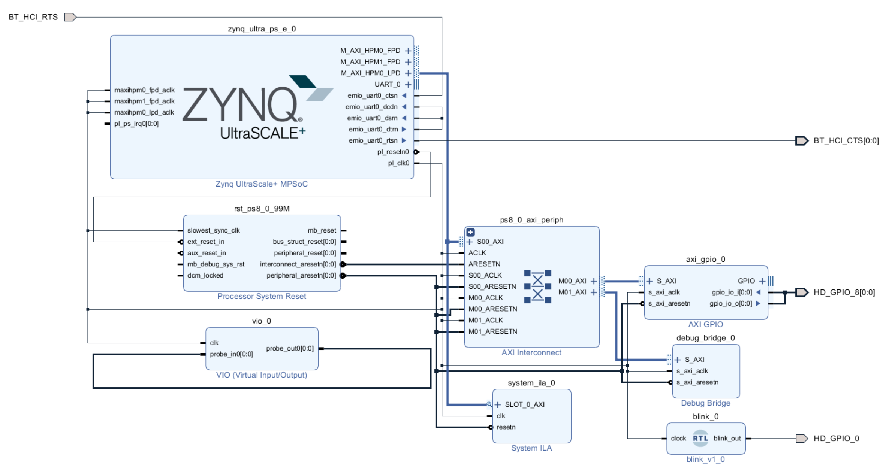

# Ultra96用 サンプルプロジェクト

## 概要

Ultra96で遊ぶための非公式サンプルプロジェクト。

## 内容

今のところはPL側のロジックを使ってLチカを行うもののみ。

あと、Debug Bridgeとかも含まれている。




## 環境

* Vivado 2018.2
* PetaLinux 2018.2
* Windowsでビルドスクリプトを実行するにはWSLが必要

## 下準備

* AVNETのチュートリアルに従って、Ultra96のボードパッケージをインストールしておく。
    * http://www.zedboard.org/support/documentation/2416
        * Installing Board Definition Files
        * http://www.zedboard.org/sites/default/files/documentations/Installing-Board-Definition-Files_v1_0.pdf
    * AVNETの [GitHubリポジトリ](https://github.com/Avnet/bdf) からBDFファイルをダウンロードして、Vivadoのインストールディレクトリの `data/boards/board_files` にコピーする

* XilinxのページからUltra96用のBSPをダウンロードしておく。
    * https://japan.xilinx.com/support/download/index.html/content/xilinx/ja/downloadNav/embedded-design-tools.html
    * 3[GiB]弱ある

## ハードウェアのビルド方法


* Linuxの場合はVivadoのパスを通す
    * 例：/opt/Xilinx/Vivado/2018.2にVivadoが入っている場合
    ```bash
    $ export PATH=$PATH:/opt/Xilinx/Vivado/2018.2/bin
    ```

* Windowsの場合は、VIVADO_ROOT環境変数にVivadoのルートディレクトリのパスを設定する。
    * 例：C:\Xilinx\Vivado\2018.2にVivadoが入っている場合
    ```
    $ export VIVADO_ROOT=/mnt/c/Xilinx/Vivado/2018.2
    ```

* `ultra96hw` ディレクトリで`make`を実行すると、プロジェクトの復元から論理合成まで一通り実行する。
    ```
    $ cd ultra96hw
    $ make
    ```

    * プロジェクトの復元のみ行いたい場合は、 `make restore` を実行する。
    ```
    $ cd ultra96hw
    $ make restore
    ```


## PetaLinuxのビルド方法

### PetaLinuxの準備

* Ubuntu上で実行する前提で説明する。
* TODO: 必要なパッケージを記載する
* /opt/Xilinx/PetaLinux にインストールしたものとする。
* `settings.sh`をsourceしておく
    ```
    $ source /opt/Xilinx/PetaLinux/settings.sh
    ```

### PetaLinuxプロジェクトの作成

* ホームディレクトリにUltra96用BSP ( `xilinx-ultra96-reva-v2018.2-final.bsp` ) があることとする。
* このリポジトリのワーキングツリーのルートで実行することとする。

```bash
$ petalinux-create -t project -s ~/xilinx-ultra96-reva-v2018.2-final.bsp -n ultra96_linux
$ cd ultra96_linux
$ petalinux-config --get-hw-description ../ultra96hw/ultra96hw.sdk
```

* 以降、`ultra96_linux` 以下で作業する。

### 追加のデバイスツリー設定のコピー
```
$ cp ../system-user.dtsi project-spec/meta-user/recipes-bsp/device-tree/files/
```

### PetaLinuxのビルド

```
$ petalinux-build
```

* ディスク空き容量が40GBくらい必要
* そこそこ時間がかかる。


### BOOT.binを作成
```
$ petalinux-package  --boot --uboot images/linux/u-boot.elf --fpga images/linux/system.bit --force
```

### SDカードにコピー

* 以下のファイルをSDカードにコピー
    * ultra96_linux/images/linux/BOOT.BIN
    * ultra96_linux/images/linux/image.ub
    * uboot.env

## Virtual Cable経由でILAを使う

* Virtual Cableを使うために、Debug Bridgeが入っている。
    * 0x00_8001_0000 にマップしてある。
* AWS EC2 F1インスタンスと同様に、Virtual Cable Server をPS上で実行しておけば、ILAやVIOといったPLに対するJTAG経由でのデバッグ機能が使用可能。
    * Debug BridgeはPLのDebug Hubに接続されるので、あくまでPLに対してのみ
* Virtual JTAGについてはAWS EC2 F1について、みんなでワイワイ調べる会での資料を参照
    * https://www.slideshare.net/ciniml/ec2-f1-virtual-jtag


### Virtual Cable Serverのビルド

* Virtual Cable ServerのソースコードはXilinxのGitHubリポジトリに置いてある。
* 元のソースコードはUIOドライバを用いるものだったが、現状ではUIOドライバの導入がうまくいっていないので、`/dev/mem`経由でアクセスするように変更している。
    * 変更したものはforkしたリポジトリに置いてある。
* Virtual Cable Serverのソースコードは `xvcserver` ディレクトリにsubmoduleとして入っているので、サブモジュールの本体を取得しておく
    * git submodule update --init
* xvcsrever/XAPP1251でmakeを実行すればビルドできる。

```
$ cd xvcserver/XAPP1251
$ make
```

### Virtual Cable Serverの実行

* 引数なしでxvcServerを実行する
```
$ ./xvcServer
```

### Vivadoから接続

* VivadoでHardware Managerを開く
* 画面上部の `Open target` をクリックし、`Open New Target` を選択する。

    

* `Connect to:` で `Local server` を選択して `Next` を押す。

    

* `Add Xilinx Virtual Cable (XVC)` を押す。

    

* `Host name` に Ultra96のアドレス、 `Port` は `2542` (デフォルト)を入力してOKを押す。
    
    

* 正常に接続できれば、`Hardware Targets` にVirtual Cableのターゲットが表示されるので選択する。
* `Hardware Devices` に `debug_bridge_0` が表示されるので選択する。
* `Next` を押して進む。
* `Finish` を押す。

    

* このままだとILAの設定が読み込まれていないので、手動で読み込む。
* `HARDWARE MANAGER` で `debug_bridge_0` を選択する。
* `Hardware Device Properties` の `Probe files:` にILAの定義ファイルのパスを設定する。
    * 直接入力もできるが、 `...` を押せばファイルダイアログが表示される。
    
    

* `ultra96hw/ultra96hw.runs/impl_1/debug_nets.ltx` を選択する。

    

* ILAを使ってみる。
    * `hw_ila_1` タブをひらいて、赤丸のところのボタン (Run trigger immediate for this ILA core) を押す
    * ILAで取得した波形が表示される。

    